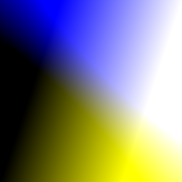

# Random Art
 

 This image was created with the following expression:

 expr1 = lambda x, y: (x + y)/2 - (x - y)
   expr2 = lambda x, y: (x - y)/2 + (x + y)
   expr3 = lambda x, y: ((pi * sin(x) - pi * sin(y)))
   expr4 = lambda x, y: (x - y)/2 * random.random
   return random.choice([expr1, expr2, expr3, expr4])

   to recreate hues.png, run create_art.py with seed at 454258044501349854
   red: <function create_expression.<locals>.<lambda> at 0x10c7c8d90>
  green: <function create_expression.<locals>.<lambda> at 0x10c7c8d08>
  blue: <function create_expression.<locals>.<lambda> at 0x10c7c8e18>

## Description

Create art using Python's random module and math functions.
